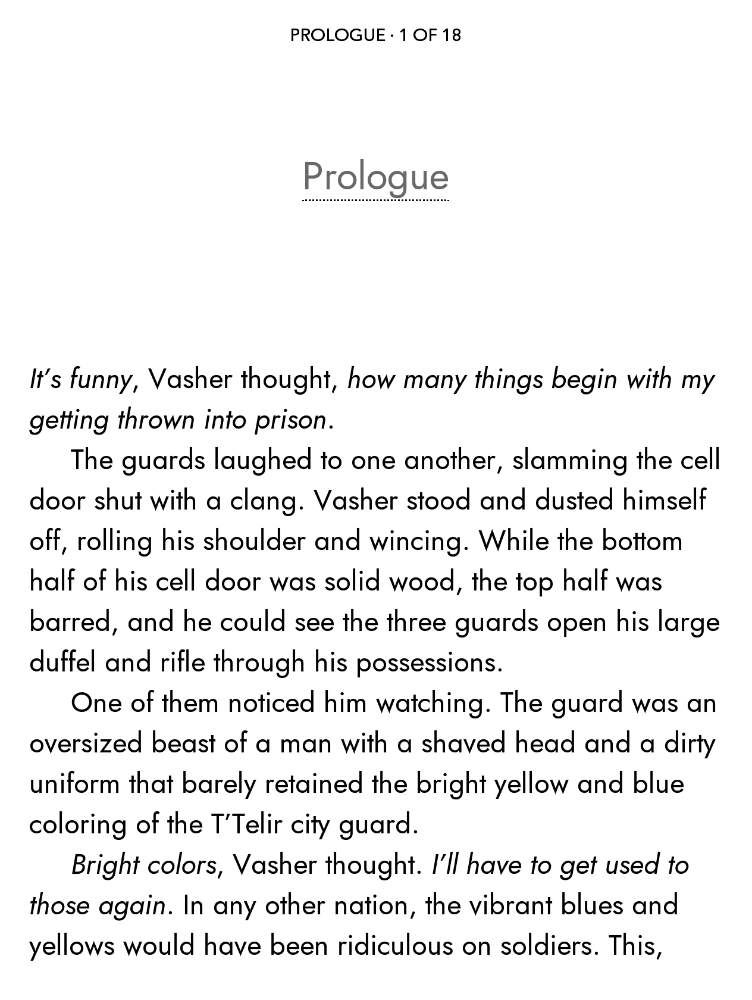

## What is this?

NV Jost is a [Jost](https://github.com/indestructible-type/Jost) variant, with a slightly altered lowercase G and single storey a (similar to Futura, only accessible via OT feature on the original font). This is an alternate version that I personally prefer.

<kbd></kbd>

## How was this made?

Using [FontForge](https://fontforge.org). I've included the FontForge files in this repository.

## License

As the original font, it is licensed under the permissive [SIL Open Font License](https://en.wikipedia.org/wiki/SIL_Open_Font_License).
